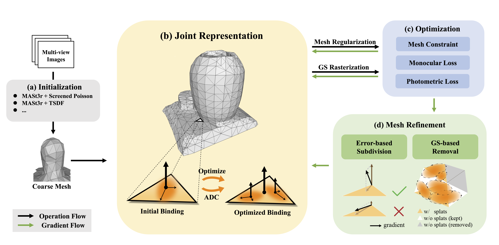

<div align="center">

# OMeGa

### Joint Optimization of Explicit Meshes and Gaussian Splats for Robust Scene-Level Surface Reconstruction

### [Project Page](https://hao7un.github.io/papers/omega/index.html) | [Paper](https://arxiv.org/abs/2509.24308) | WACV 2026 (Oral)

Yuhang Cao<sup>1\*</sup>, Haojun Yan<sup>2\*</sup>, Danya Yao<sup>1&dagger;</sup>

<sup>1</sup>Tsinghua University &nbsp;&nbsp; <sup>2</sup>Beihang University

<sub>\*Equal contribution &nbsp; &dagger;Corresponding author</sub>

<p>
  
</p>

</div>

## Overview

**OMeGa** is an end-to-end framework that jointly optimizes an explicit triangle mesh and 2D Gaussian splats for indoor scene reconstruction. By flexibly binding 2D Gaussian Splats to mesh faces, OMeGa achieves both high-fidelity novel view rendering and accurate surface reconstruction.

**Key features:**
- 🔗 **Flexible Binding** — 2D Gaussian Splats are bound to mesh faces with adaptive spatial attributes, allowing splats to move freely within the face plane
- 📐 **Mesh-Guided Optimization** — Mesh constraints (Laplacian smoothing, normal consistency) and monocular normal supervision regularize geometry learning
- 🔄 **Iterative Mesh Refinement** — Error-based subdivision densifies high-detail areas; GS-based removal prunes inconsistent faces
- 🏗️ **Coarse Mesh Initialization** — Works with simple initialization (e.g., Vision Foundation Models + Screened Poisson) — no pretrained GS model required

---

## Installation

### Prerequisites

- Python >= 3.9
- CUDA Toolkit >= 11.8
- PyTorch >= 2.0 (with matching CUDA version)

Install PyTorch first following the [official instructions](https://pytorch.org/get-started/locally/). For example, with CUDA 11.8:
```bash
pip install torch torchvision --index-url https://download.pytorch.org/whl/cu118
```

### Setup

```bash
# Clone the repository (--recursive for submodules)
git clone --recursive https://github.com/Hao7un/OMeGa.git
cd OMeGa

# Install gsplat (builds CUDA kernels from source)
pip install -v -e .

# Install training dependencies
pip install -r examples/requirements.txt

# Install PyTorch3D (see: https://github.com/facebookresearch/pytorch3d/blob/main/INSTALL.md)
pip install "git+https://github.com/facebookresearch/pytorch3d.git"
```

---

## Data Preparation

OMeGa expects a COLMAP-formatted dataset with the following structure:

```
<data_dir>/
├── images/              # Input images
├── sparse/0/            # COLMAP sparse reconstruction
│   ├── cameras.bin
│   ├── images.bin
│   └── points3D.bin
├── normal_maps/         # Monocular normal maps (Step 1)
└── vfm_sparse/0/        # Dense point cloud (Step 2)
    └── points3D.ply
```

### Step 1: Monocular Normal Estimation

We use [Stable Normal](https://github.com/hugoycj/StableNormal) to generate monocular normal maps for supervision (saved to `<data_dir>/normal_maps/`). We recommend a separate conda environment to avoid dependency conflicts.

```bash
python scripts/generate_normal_maps.py --data_dir /path/to/colmap_dataset
```

### Step 2: Dense Point Cloud Generation

We provide a script using [VGGT](https://github.com/facebookresearch/vggt) to generate a dense point cloud for mesh initialization, with automatic Sim(3) alignment to the COLMAP coordinate system. We recommend a separate conda environment.

```bash
python scripts/generate_dense_pcd.py --data_dir /path/to/colmap_dataset \
    --group_size 60 \           # max images per group, adjust for VRAM
    --target_num_points 500000   # target point count after downsampling
```

The point cloud will be saved to `<data_dir>/vfm_sparse/0/points3D.ply`.

### Step 3: Initial Mesh Generation

Generate a coarse mesh from the dense point cloud via [Screened Poisson Reconstruction](https://www.cs.jhu.edu/~misha/Code/PoissonRecon/):

```bash
python -c "
import open3d as o3d
pcd = o3d.io.read_point_cloud('path/to/vfm_sparse/0/points3D.ply')
mesh, _ = o3d.geometry.TriangleMesh.create_from_point_cloud_poisson(pcd, depth=9)
o3d.io.write_triangle_mesh('path/to/init_mesh.ply', mesh)
"
```

---

## Training

```bash
cd examples

python simple_trainer_meshgs.py \
    --disable_viewer \
    --data_dir /path/to/colmap_dataset \
    --result_dir /path/to/output \
    --path_to_mesh /path/to/init_mesh.ply \
    --vfm_init \
    --app_opt \
    --mesh_loss \
    --normal_map_on \
    --mono_normal_loss
```

<details>
<summary><b>Key Arguments</b></summary>

| Argument | Default | Description |
|----------|---------|-------------|
| `--data_dir` | — | Path to COLMAP dataset |
| `--result_dir` | — | Path to save results |
| `--path_to_mesh` | — | Path to initial mesh (.ply) |
| `--max_steps` | 30000 | Number of training steps |
| `--batch_size` | 1 | Batch size for training |
| `--test_every` | 8 | Every N images is a test image |

**Mesh Optimization:**

| Argument | Default | Description |
|----------|---------|-------------|
| `--mesh_loss` | False | Enable mesh constraints |
| `--mesh_loss_start_iter` | 1000 | Iteration to start mesh constraints |
| `--mesh_smooth_lambda` | 40.0 | Weight for Laplacian smoothing loss |
| `--mesh_normal_consistency_lambda` | 1.0 | Weight for mesh normal consistency loss |
| `--mesh_split_topk` | 0.02 | Top-k fraction of faces for subdivision |
| `--mesh_refine_start_iter` | 3000 | Iteration to start mesh refinement |
| `--split_every` | 500 | Mesh subdivision interval (steps) |
| `--remove_every` | 500 | Mesh removal interval (steps) |
| `--init_opa` | 0.01 | Initial opacity of Gaussian splats |
| `--min_rel_scale` | 0.1 | Minimum relative scale of splats to face |
| `--max_rel_scale` | 1.5 | Maximum relative scale of splats to face |

**Monocular Normal Supervision (L<sub>n</sub>):**

| Argument | Default | Description |
|----------|---------|-------------|
| `--normal_map_on` | False | Load monocular normal maps |
| `--mono_normal_loss` | False | Enable monocular normal loss |
| `--mono_normal_lambda` | 0.5 | Weight for monocular normal loss |
| `--mono_normal_loss_start_iter` | 3000 | Iteration to start normal supervision |

**Appearance & Initialization:**

| Argument | Default | Description |
|----------|---------|-------------|
| `--app_opt` | False | Enable appearance embedding |
| `--app_embed_dim` | 16 | Appearance embedding dimension |
| `--vfm_init` | False | Use VFM dense point cloud for initialization |

</details>

---

## Evaluation

Rendering metrics (PSNR, SSIM, LPIPS) are automatically computed on held-out test views at `--eval_steps`. The optimized mesh is saved during training.

---

## Datasets

We evaluate on the following indoor benchmarks:

| Dataset | Scenes | Link |
|---------|--------|------|
| MuSHRoom | 5 | [Project Page](https://xuqianren.github.io/publications/MuSHRoom/) |
| ScanNet | 8 | [Project Page](http://www.scan-net.org/) |
| ScanNet++ | 2 | [Project Page](https://kaldir.vc.in.tum.de/scannetpp/) |

---

## Citation

If you find this work useful, please cite:

```bibtex
@inproceedings{cao2026omega,
  title={OMeGa: Joint Optimization of Explicit Meshes and Gaussian Splats for Robust Scene-Level Surface Reconstruction},
  author={Cao, Yuhang and Yan, Haojun and Yao, Danya},
  booktitle={Proceedings of the IEEE/CVF Winter Conference on Applications of Computer Vision},
  pages={4386--4395},
  year={2026}
}
```

## Acknowledgements

This codebase is built upon [gsplat](https://github.com/nerfstudio-project/gsplat) and [2D Gaussian Splatting](https://github.com/hbb1/2d-gaussian-splatting). We thank the authors for their excellent open-source implementations. We also acknowledge [VGGT](https://github.com/facebookresearch/vggt), [Stable Normal](https://github.com/hugoycj/StableNormal), [DUSt3R](https://github.com/naver/dust3r), and [MASt3R](https://github.com/naver/mast3r) for their contributions.
